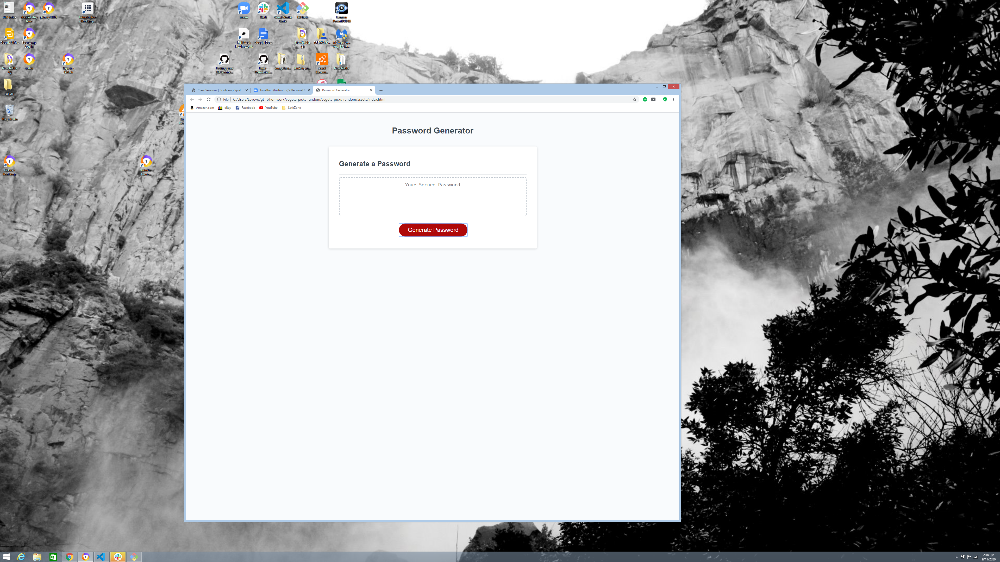
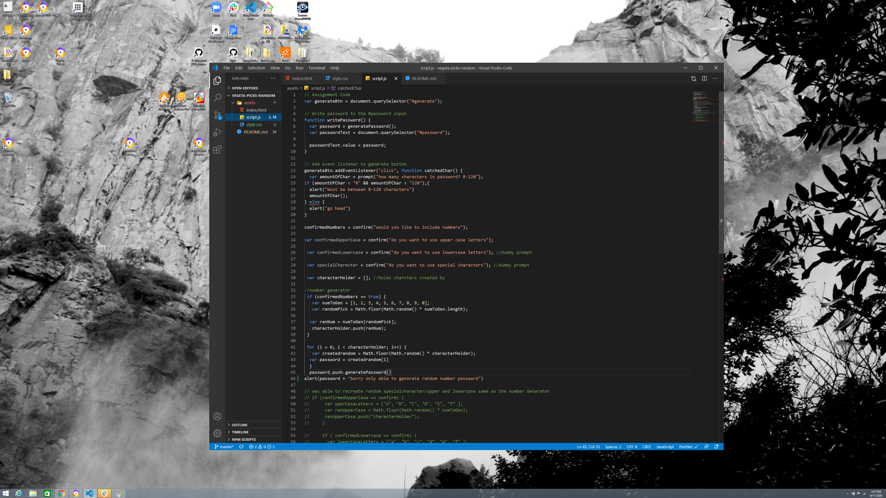

# vegeta-picks-random

name of project: vageta-picks-random

Date started: 9-1-20

source: Georgia Tech Coding Bootcamp

Was asked to code the javascript on the index.html given by the the bootcamp instructor.
When you open index.html in browser, you can see written password generator and inside the box you'll see a smaller box with secure password and a generate Password button.

My job was to create prompts that asks the user, what criteria(numbers,letters and special charters) the user wants in the password that is going to be generated

after creating hard code:
started by adding an 'eventlistener' to 'generate password' then added promts to ask for confirmation if
user wanted to use special characters, uppercase, numbers etc.

Was able to make the 'var'='prompt' that asked 'howmanycharacters' do you want in 'password'
to Wrap the 'howmanycharacters' into a 'function' that calls itself backed if the character selected is '<' '"8"' & > 120 characters.

Was also able to make the 'var' 'confirmed' that confirmed the user to unclude numbers to 'password'

used 'Math.floor' and 'Math.random()' to generate the selected variable 'howmanycharacters'
and variable 'confirmednumber' to generate a random numbers with the lenght of 'howmanycharacters' "the selected amount of CHAR"

then I took those numbers and stored them in a variable called 'characterHolder' and with a for loop
used to finally '.pushed' 'characterHolder' to password and created an 'alert'
that gave the users generated password.

last comments:

was not successful in producing random password using numbers wih this code
'for (i = 0; i < parseInt(amountOfChar); i++) {
var createdrandom = Math.floor(Math.random() \* characterHolder.length);
var password = password.concat(createdrandom[i]);'

[this is the link to the page](https://wilmer88.github.io/vegeta-picks-random/)
